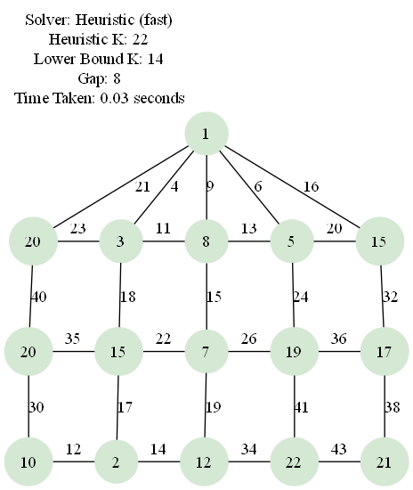

# Mongolian Tent Graph k-Labeling



A Python toolkit for exploring k-labelings of *Mongolian Tent* graphs, a three-row ladder structure topped with a central apex.  The project supports:

* **Graph generation** – build ladder graphs *L*₃,ₙ and Mongolian Tent graphs *MT*₍₃,ₙ₎.
* **Solvers**
  * Exact backtracking solver for small *n*.
  * Fast *randomised greedy* heuristic able to find feasible labelings for much larger graphs.
* **Visualisation** – render labelings to PNG via Graphviz.
* **Extensive unit tests** covering graph construction and solver behaviour.

---

## Quick start

```bash
# 1. Clone & enter repository
$ git clone <repo-url> && cd vertex-k-labeling

# 2. Create & activate virtual-env (optional but recommended)
$ python -m venv venv
$ source venv/bin/activate  # Windows: venv\Scripts\activate

# 3. Install dependencies
$ pip install -r requirements.txt

# 4. Install the Graphviz **system package**
#    (needed only for visualisation)
#    • Linux:   sudo apt install graphviz
#    • macOS:   brew install graphviz
#    • Windows: download from graphviz.org and add the \bin directory to PATH

# 5. Run the demo script (n=5 by default)
$ python main.py
```

The script prints a feasible *k* and saves a visualisation (`mt3_5_heuristic.png`, preview above).

---

## Usage

### Generating a graph

```python
from src.graph_generator import generate_mongolian_tent_graph
G = generate_mongolian_tent_graph(n=8)
```

### Finding a labeling

```python
from src.labeling_solver import find_heuristic_labeling
k, labeling = find_heuristic_labeling(n=8)
```

### Rendering

```python
from src.visualization import visualize_labeling
visualize_labeling(G, labeling, output="mt3_8.png")
```

---

## Running tests

```bash
$ python -m unittest discover tests -v
```

All tests should pass (graph generation, properties, solvers, performance stubs).

---

## Project structure

```
vertex-k-labeling/
├─ src/                  # Library code
│  ├─ graph_generator.py
│  ├─ graph_properties.py
│  ├─ labeling_solver.py
│  └─ visualization.py
├─ tests/                # Unit tests
├─ ai-docs/              # Design & planning docs
├─ main.py               # Demo / entry point
└─ requirements.txt      # Python dependencies
```

---

## Background

A *k-labeling* assigns positive integers to vertices such that every edge weight (sum of the labels of its endpoints) is unique.  Computing the minimum viable *k* is NP-hard; our heuristic trades optimality for speed by performing many randomised greedy passes under an adaptive bound.
