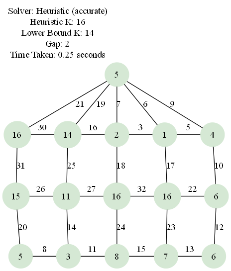
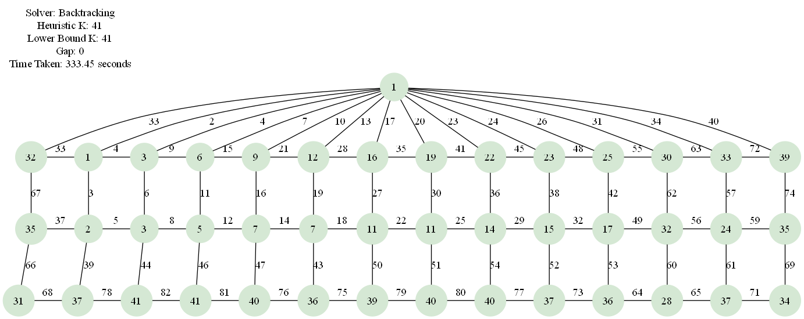

# Mongolian Tent Graph k-Labeling



A Python toolkit for exploring k-labelings of *Mongolian Tent* graphs, a three-row ladder structure topped with a central apex.  The project supports:

* **Graph generation** – build ladder graphs *L*₃,ₙ and Mongolian Tent graphs *MT*₍₃,ₙ₎.
* **Solvers**
  * Exact backtracking solver for small *n* (guaranteed optimal but exponential time).
  * Heuristic family for much larger graphs (quick, not always optimal):
    * **Accurate mode** – default randomised-greedy with many vertex/order shuffles to escape local minima.
    * **Fast mode** – new multi-pass first-fit greedy with a handful of random passes proportional to *n* (ultra-fast; may return a slightly larger *k*).
* **Visualisation** – render labelings to PNG via Graphviz.
* **Extensive unit tests** covering graph construction and solver behaviour.

---

## Quick start

```bash
# 1. Clone & enter repository
$ git clone <repo-url> && cd vertex-k-labeling

# 2. Create & activate virtual-env (optional but recommended)
$ python -m venv venv
$ source venv/bin/activate  # Windows: venv\Scripts\activate

# 3. Install dependencies
$ pip install -r requirements.txt

# 4. Install the Graphviz **system package**
#    (needed only for visualisation)
#    • Linux:   sudo apt install graphviz
#    • macOS:   brew install graphviz
#    • Windows: download from graphviz.org and add the \bin directory to PATH

# 5. Run the demo script
#    Heuristic solver (accurate mode is default):
#    Standard run (accurate heuristic mode, no animation):
#    n_value is optional and defaults to 5
$ python main.py [--n <n_value>]
#    Fast heuristic mode:
$ python main.py --n <n_value> --heuristic_mode fast
#    Live animation display:
$ python main.py --n <n_value> --animate live
#    Record animation to GIF/MP4:
$ python main.py --n <n_value> --animate record
#    For backtracking solver:
$ python main.py --n <n_value> --solver backtracking
#    Circulant graph generation:
$ python main.py --graph-type circulant --n <n_value> --r <r_value>
```

The script prints a feasible *k* and saves a visualisation (`mt3_<n>_heuristic_<mode>.png` or `mt3_<n>_backtracking.png`).

---

## Visual comparison: backtracking (optimal) vs accurate heuristic (feasible)

Below is an example for *n = 14* (images generated by the demo script twice—once with backtracking, once with the accurate heuristic). The backtracking algorithm finds an **optimal** labeling that minimizes the maximum label *k*, but its runtime grows exponentially with *n*. In contrast, the accurate heuristic (multi-attempt greedy) completes in under 2 seconds, yielding a **feasible** labeling that may use slightly higher *k* values.

| Backtracking (optimal) (`graphs/mt3_14_backtracking.png`) | Accurate heuristic (feasible) (`graphs/mt3_14_heuristic_accurate.png`) |
|---------------------------------------------------------|--------------------------------------------------------------------|
|      |   |

*Figure: Side-by-side comparison—optimal backtracking achieves minimal *k* at exponential cost, while the heuristic finds a near-optimal solution rapidly.*

---

## Heuristic modes explained

| Mode | CLI value | Core idea | Passes | Typical speed | k-quality |
|------|-----------|-----------|--------|---------------|-----------|
| Accurate (default) | `accurate` | Randomised greedy: many vertex/order shuffles to escape local minima. | 100 × attempts (configurable) | Fast for n ≤ 8, slower for very large n | Best chance of low k |
| Fast | `fast` | Deterministic first-fit by degree, then only *⌈n/2⌉* (max 10) random attempts. | ≤ 11 | Very fast | Slightly higher k possible |

Choose `fast` when you need a quick, “good-enough” result (e.g., exploratory runs or large n), and switch back to `accurate` when precision matters.

---

## Usage

### Generating a graph

```python
from src.graph_generator import generate_mongolian_tent_graph
G = generate_mongolian_tent_graph(n=8)
```

```python
from src.graph_generator import generate_circulant_graph
G = generate_circulant_graph(n=12, r=5)
```

### Finding a labeling

```python
from src.labeling_solver import find_heuristic_labeling
k, labeling = find_heuristic_labeling(n=8)
```

### Rendering

```python
from src.visualization import visualize_labeling
visualize_labeling(G, labeling, output="mt3_8.png")
```

---

## Command-line utilities

| Script | Path | Purpose |
|--------|------|---------|
| Demo / solver runner | `main.py` | Find a feasible labeling, print results, optionally visualise. Supports `--n`, `--solver`, `--heuristic_mode`. |
|  |  | Supports `--n`, `--solver`, `--heuristic_mode`, and `--animate {off,live,record}` for live or recorded animations. |
| Stand-alone visualiser | `src/visualization.py` | Render a pre-computed labeling to PNG/SVG. Expects `n` and output filename; internally calls the backtracking solver by default. Useful for re-rendering or experimenting with Graphviz styles. |

Examples:

```bash
# Run heuristic fast mode and view PNG
python main.py --n 20 --heuristic_mode fast

# Render a previously stored labeling JSON (example)
python -m src.visualization mt_labeling.json --file tent.png

# Run tests
python -m unittest discover tests -v
```

---

## Running tests

```bash
$ python -m unittest discover tests -v
```

All tests should pass (graph generation, properties, solvers, performance stubs).

---

## Project structure

```
vertex-k-labeling/
├─ src/                  # Library code
│  ├─ graph_generator.py
│  ├─ graph_properties.py
│  ├─ labeling_solver.py
│  └─ visualization.py
├─ tests/                # Unit tests
├─ ai-docs/              # Design & planning docs
├─ main.py               # Demo / entry point
└─ requirements.txt      # Python dependencies
```

---

## Background

A *k-labeling* assigns positive integers to vertices such that every edge weight (sum of the labels of its endpoints) is unique. Computing the minimum viable *k* is NP-hard; our heuristic trades optimality for speed by performing many randomised greedy passes under an adaptive bound.

---

## Documentation & design notes

The `ai-docs/` folder contains detailed design discussions, task breakdowns and enhancement proposals.

| Category | Documents |
|----------|-----------|
| 📐 Initial design | [Master plan](ai-docs/initial-design/master_plan.md), [Task 1](ai-docs/initial-design/task_1.md), [Task 2](ai-docs/initial-design/task_2.md), [Task 3](ai-docs/initial-design/task_3.md), [Task 4](ai-docs/initial-design/task_4.md), [Task 5](ai-docs/initial-design/task_5.md) |
| ⚙️ Algorithms | [Heuristic algorithm overview](ai-docs/algorithms/heuristic_algorithm.md) |
| 🚀 Enhancements | [Parallelism & Profiling](ai-docs/enhancments/enhancement_parallelism_profiling.md), [CP-SAT solver](ai-docs/enhancments/enhancement_CP-SAT_solver.md), [Add visualisation](ai-docs/enhancments/enhancment01_add_visualization.md), [Shape-graph support](ai-docs/enhancments/enhancement02_shape_graph.md) |
| 🛠️ Fixes | [Incorrect ladder levels](ai-docs/fixes/fix_incorrect_ladder_levels.md), [Large-n solution strategy](ai-docs/fixes/large_n_solution.md), [Greedy solver inefficiency optimization](ai-docs/fixes/fix_greedy_inefficiency.md), [Optimize Backtracking Performance](ai-docs/fixes/fix_backtracking_performance.md) |

These notes outline the project’s evolution and provide context for future contributors.