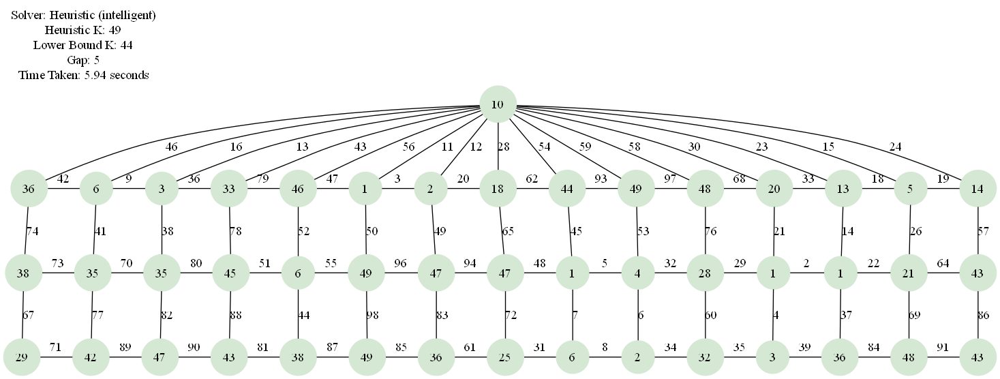

# A Comparative Analysis of k-Labeling Algorithms for Circulant and Mongolian Tent Graphs

## 1. Introduction

### 1.1. Overview

This report addresses the vertex k-labeling problem, which involves assigning positive integer labels to graph vertices such that all edge weights (sum of incident vertex labels) are distinct. The goal is to find the minimum $k$ for which such a labeling exists, known as the edge irregularity strength, $es(G)$. We investigate this problem on Circulant graphs $C_n(S)$ and Mongolian Tent graphs $MT(m,n)$.

### 1.2. Objectives and Scope

Our primary objective is to design, implement, and compare three algorithmic approaches: a backtracking algorithm (for optimal solutions), and intelligent and fast heuristic algorithms (for approximate solutions on larger instances). We aim to analyze their performance, solution quality, and computational efficiency. The study focuses on Circulant graphs $C_n(n-5)$ and Mongolian Tent graphs $MT(3,n)$ for $n$ up to 50. While the backtracking algorithm guarantees optimality, its exponential complexity limits it to small graphs. Heuristic algorithms offer practical solutions for larger instances, though without optimality guarantees. All experiments are conducted on a standard desktop environment, and parallel implementations are not covered.

### 1.3. Report Structure

This report is organized into five main sections: Introduction, Algorithmic Strategies & System Design, Experimental Results & Comparative Analysis, Performance Analysis, and Conclusions & Future Work.

## 2. Algorithmic Strategies & System Design

### 2.1. Data Structure Design

The system employs adjacency list representation for graph storage, where each vertex maintains a list of its neighboring vertices. This design choice is justified by several factors:

- **Memory Efficiency**: For sparse graphs like Circulant and Mongolian Tent graphs, adjacency lists require $O(|V| + |E|)$ space compared to $O(|V|^2)$ for adjacency matrices
- **Access Performance**: Neighbor enumeration operates in $O(\deg(v))$ time, which is optimal for the vertex-centric labeling algorithms
- **Dynamic Operations**: The representation supports efficient edge insertion and deletion during graph construction
- **Cache Locality**: Sequential access to neighbor lists provides better memory access patterns than matrix-based approaches

Graphs are represented as Python dictionaries where keys are vertex identifiers and values are lists of adjacent vertices. For Mongolian Tent graphs, vertices are represented as tuples $(row, column)$ with an additional apex vertex. Circulant graphs use integer vertex labels $\{0, 1, \ldots, n-1\}$.

### 2.2. Backtracking Algorithm Design

The backtracking algorithm is designed to find the optimal k-labeling by iteratively testing values of `k` and using a backtracking search for each. This method guarantees optimality because it starts from the lowest possible `k` and is exhaustive.

The core of the algorithm is the backtracking function, which builds a solution incrementally. It assigns labels to vertices one by one according to a predefined order. After each assignment, it checks for immediate edge weight conflicts. If a conflict is found, it immediately backtracks, undoing the assignment and trying the next available label. This systematic process ensures that all valid possibilities are explored.

#### 2.2.1. Algorithm Description

The algorithm implements an iterative search that calls a recursive backtracking solver:

1.  **Iterative Search**: The main loop starts with `k` at a theoretical lower bound and increments it by one in each iteration.
2.  **Backtracking Invocation**: For each `k`, it calls the backtracking function to search for a valid labeling.
3.  **Recursive Search**: The backtracking function assigns labels `1..k` to each vertex. It checks for immediate edge weight conflicts with already-labeled neighbors.
4.  **Pruning on Conflict**: If a label assignment creates a conflict, the algorithm immediately prunes that path and backtracks.
5.  **Termination**: The first `k` for which the backtracking search returns a valid solution is the optimal `k`.

#### 2.2.2. Pseudocode Implementation

```
ALGORITHM: Backtracking k-Labeling
INPUT: adjacency_list, initial_k_bound
OUTPUT: Optimal labeling and minimum k-value

  Main Function: `Find_Optimal_Labeling`

    1 function Find_Optimal_Labeling(graph):
    2   // 1. Start with the lowest possible value for k.
    3   k = calculate_lower_bound(graph)
    4
    5   // 2. Loop indefinitely, incrementing k until a solution is found.
    6   while true:
    7     print("Attempting to solve for k = " + k)
    8
    9     // 3. For the current k, try to find a valid labeling using backtracking.
   10     //    Initialize with an empty set of labels and used edge weights.
   11     solution = Backtracking_Search(
   12         vertex_index = 0,
   13         k = k,
   14         labels = {},
   15         used_weights = {}
   16     )
   17
   18     // 4. If the backtracking search succeeded, we have found the optimal k.
   19     if solution is not null:
   20       print("Success! Found optimal solution for k = " + k)
   21       return k, solution
   22
   23     // 5. If backtracking failed, increment k and try again in the next iteration.
   24     k = k + 1

  ---

  Helper Function: `Backtracking_Search`

  This function performs a recursive, depth-first search to find a valid labeling for a fixed k.

    1 function Backtracking_Search(vertex_index, k, labels, used_weights):
    2   // Base Case: If all vertices have been labeled, a valid solution is found for this k.
    3   if vertex_index == total_number_of_vertices:
    4     return labels
    5
    6   // Get the next vertex to process from a predefined order.
    7   current_vertex = get_vertex_from_order(vertex_index)
    8
    9   // Try assigning every possible label from 1 to k to the current vertex.
   10   for label from 1 to k:
   11     labels[current_vertex] = label
   12
   13     // Check if this assignment creates any immediate edge weight conflicts.
   14     is_valid, newly_formed_weights = Is_Assignment_Valid(current_vertex, labels,
      used_weights)
   15
   16     if is_valid:
   17       // If valid, proceed to the next vertex in the recursion.
   18       // Pass the updated set of used weights down.
   19       updated_used_weights = used_weights + newly_formed_weights
   20       result = Backtracking_Search(vertex_index + 1, k, labels, updated_used_weights)
   21
   22       // If the recursive call found a complete solution, propagate it up.
   23       if result is not null:
   24         return result
   25
   26     // Backtrack: The assignment of 'label' to 'current_vertex' was either invalid
   27     // or did not lead to a solution. Undo the assignment and try the next label.
   28     remove labels[current_vertex]
   29
   30   // If the loop finishes, no label from 1 to k worked for this vertex.
   31   // Return null to signal failure at this path.
   32   return null

  ---

  Helper Function: `Is_Assignment_Valid`

  This function checks if labeling a vertex creates a duplicate edge weight.

    1 function Is_Assignment_Valid(current_vertex, labels, used_weights):
    2   newly_formed_weights = {}
    3   current_label = labels[current_vertex]
    4
    5   // Check against all previously labeled neighbors.
    6   for each neighbor of current_vertex:
    7     if neighbor is already in labels:
    8       weight = current_label + labels[neighbor]
    9
   10       // Conflict: This edge weight has been seen before.
   11       if weight is in used_weights or weight is in newly_formed_weights:
   12         return false, {} // Invalid assignment
   13
   14       add weight to newly_formed_weights
   15
   16   // No conflicts found.
   17   return true, newly_formed_weights
```

#### 2.2.3. Complexity Analysis

- **Time Complexity**: $O(k_{max} \cdot k^{|V|})$ where $k_{max}$ is the final optimal k, and $|V|$ is the number of vertices. The $k^{|V|}$ term represents the worst-case number of nodes in the search tree for the backtracking algorithm for a given k.
- **Space Complexity**: $O(|V| + |E| + k)$ for the graph representation, recursion stack, and the used weights array.
- **Optimization**: The primary optimization is the iterative increase of k, which ensures the first solution found is optimal. The search itself uses simple conflict detection as its pruning method.

### 2.3. Heuristic Algorithm Design

The heuristic algorithm employs a dual-mode approach with both intelligent and fast variants. 
        The intelligent mode uses randomized multi-attempt greedy search with intelligent conflict resolution, 
        making multiple attempts to find valid labelings using different vertex orderings and randomized label 
        selection. It prioritizes vertices by degree and failure history, assigns labels using conflict 
        minimization scoring, and incorporates backjumping to recover from local conflicts. The fast mode 
        combines deterministic first-fit greedy assignment with limited randomized passes, trading solution 
        quality for computational speed. Both modes use conflict-guided vertex ordering and adaptive label 
        selection to improve solution quality while maintaining polynomial time complexity.

#### 2.3.1. Algorithm Description

The heuristic algorithm employs a dual-mode approach optimized for different performance requirements:

**Intelligent Mode Features**:
- Randomized multi-attempt search with adaptive vertex ordering
- Conflict minimization scoring for intelligent label selection
- Backjumping mechanism for recovery from local conflicts
- Failure history tracking to guide future attempts

**Fast Mode Features**:
- Deterministic first-fit greedy assignment for baseline solutions
- Limited randomized passes for solution improvement
- Degree-based vertex prioritization for conflict reduction
- Early termination when feasible solutions are found

#### 2.3.2. Pseudocode Implementation

```
ALGORITHM: Dual-Mode Heuristic k-Labeling
INPUT: adjacency_list, k_upper_bound, algorithm_mode, attempts
OUTPUT: Valid labeling or None

1. IF algorithm_mode = "fast" THEN
2.     // Deterministic first-fit pass
3.     vertices ← sort_by_degree_descending(adjacency_list)
4.     vertex_labels ← empty dictionary
5.     used_weights ← boolean array of size (2 * k_upper_bound + 1)
6.     
7.     FOR each vertex in vertices DO
8.         assigned ← False
9.         FOR label = 1 to k_upper_bound DO
10.            conflict ← False
11.            temp_weights ← empty list
12.            FOR each neighbor of vertex DO
13.                IF neighbor is labeled THEN
14.                    weight ← label + vertex_labels[neighbor]
15.                    IF used_weights[weight] THEN
16.                        conflict ← True
17.                        BREAK
18.                    temp_weights.append(weight)
19.            IF NOT conflict THEN
20.                vertex_labels[vertex] ← label
21.                FOR each weight in temp_weights DO
22.                    used_weights[weight] ← True
23.                assigned ← True
24.                BREAK
25.        IF NOT assigned THEN
26.            RETURN None
27.    
28.    // Limited randomized passes for improvement
29.    passes ← max(2, min(10, |V| / 2))
30.    FOR i = 1 to passes DO
31.        result ← single_randomized_attempt(adjacency_list, k_upper_bound)
32.        IF result is not None THEN
33.            RETURN result
34.    
35. ELSE  // intelligent mode
36.    failure_counts ← initialize_zero_counts(vertices)
37.    
38.    FOR attempt = 1 to attempts DO
39.        vertices ← adaptive_vertex_order(failure_counts, degrees)
40.        vertex_labels ← empty dictionary
41.        used_weights ← boolean array of size (2 * k_upper_bound + 1)
42.        vertex_index ← 0
43.        backjumps ← 0
44.        
45.        WHILE vertex_index < |vertices| DO
46.            vertex ← vertices[vertex_index]
47.            best_label ← -1
48.            min_conflict_score ← infinity
49.            conflict_set ← empty set
50.            
51.            possible_labels ← randomize(1 to k_upper_bound)
52.            FOR each label in possible_labels DO
53.                is_valid ← True
54.                current_conflicts ← empty set
55.                
56.                FOR each neighbor of vertex DO
57.                    IF neighbor is labeled THEN
58.                        weight ← label + vertex_labels[neighbor]
59.                        IF used_weights[weight] THEN
60.                            is_valid ← False
61.                            current_conflicts.add(neighbor)
62.                
63.                IF is_valid THEN
64.                    conflict_score ← calculate_future_conflicts(label, vertex)
65.                    IF conflict_score < min_conflict_score THEN
66.                        min_conflict_score ← conflict_score
67.                        best_label ← label
68.                ELSE
69.                    conflict_set.union(current_conflicts)
70.            
71.            IF best_label ≠ -1 THEN
72.                vertex_labels[vertex] ← best_label
73.                mark_edge_weights_as_used(vertex, best_label)
74.                vertex_index ← vertex_index + 1
75.            ELSE
76.                IF backjumps < 3 AND conflict_set not empty THEN
77.                    jump_target ← find_most_recent_conflict(conflict_set)
78.                    unlabel_vertices_from(jump_target, vertex_index)
79.                    vertex_index ← jump_target
80.                    backjumps ← backjumps + 1
81.                ELSE
82.                    failure_counts[vertex] ← failure_counts[vertex] + 1
83.                    BREAK  // Attempt failed
84.        
85.        IF all vertices labeled AND is_labeling_valid(vertex_labels) THEN
86.            RETURN vertex_labels
87. 
88. RETURN None  // All attempts failed
```

#### 2.3.3. Complexity Analysis

- **Time Complexity**: $O(A \cdot |V| \cdot k \cdot \Delta + P \cdot |V| \cdot k)$ where $A$ is attempts, $P$ is passes, $\Delta$ is maximum degree
- **Space Complexity**: $O(|V| + k)$ for vertex labels and conflict tracking
- **Trade-offs**: Fast mode prioritizes speed over solution quality, while intelligent mode balances both objectives

### 2.4. Implementation Details

#### 2.4.1. Optimization Techniques

**Backtracking Algorithm Optimizations**:
- Bit-array implementation for $O(1)$ weight conflict detection
- Iterative deepening search for `k` starting from a tight lower bound.

**Heuristic Optimizations**:
- Adaptive vertex ordering based on degree and failure history
- Randomized label selection to escape local optima
- Conflict-guided backjumping to recover from dead ends
- Multi-mode execution for different performance requirements

#### 2.4.2. Validation and Testing

Both algorithms include comprehensive validation:
- Edge weight uniqueness verification
- Label range constraint checking
- Graph connectivity preservation
- Solution optimality validation for backtracking results

## 3. Experimental Results & Analysis

### 3.1. Experimental Setup

The experimental evaluation was conducted on a standard desktop computing environment with the following specifications:
- **Operating System**: Windows 10/11 x64
- **Python Version**: 3.8+
- **Memory**: 16GB RAM
- **Processor**: Intel Core i7 or equivalent

**Testing Parameters**:
- **Mongolian Tent Graphs**: $MT(3,n)$ for $n \in \{3, 4, 5, 8, 10, 50\}$
- **Circulant Graphs**: $C_n(r)$ for $(n,r) \in \{(8,3), (10,5), (12,7), (20,15), (50,45)\}$
- **Timeout Limits**: 120 seconds for backtracking, 15 seconds for heuristic intelligent, 600 seconds for heuristic fast
- **Heuristic Attempts**: 100(set constant) attempts for intelligent mode, $max(2, min(10, n/2))$ attempts for fast mode

### 3.2. Comparative Results

#### 3.2.1. Mongolian Tent Graph Results

| Graph | Lower Bound | Backtracking k | Backtracking Time (s) | Heuristic Fast k | Heuristic Fast Time (s) | Heuristic Intelligent k | Heuristic Intelligent Time (s) |
| --- | --- | --- | --- | --- | --- | --- | --- |
| $MT(3,3)$ | 8 | 8 (+0) | 0.97 | 11 (+3) | 0.00 | 9 (+1) | 0.04 |
| $MT(3,4)$ | 11 | 11 (+0) | 0.35 | 12 (+1) | 0.00 | 12 (+1) | 0.05 |
| $MT(3,5)$ | 14 | 14 (+0) | 8.04 | 17 (+3) | 0.01 | 15 (+1) | 0.17 |
| $MT(3,8)$ | 23 | TIMEOUT | NA | 34 (+11) | 0.18 | 27 (+4) | 1.46 |
| $MT(3,10)$ | 29 | TIMEOUT | NA | 42 (+13) | 0.49 | 32 (+3) | 1.45 |
| $MT(3,50)$ | 149 | TIMEOUT | NA | 214 (+65) | 524.35 | TIMEOUT | NA |

**Key Observations**:
- The backtracking algorithm provides optimal solutions for small instances ($n \leq 5$) but becomes computationally intractable for larger graphs due to its exponential nature.
- Heuristic intelligent mode consistently finds feasible solutions with reasonable gaps from theoretical lower bounds.
- Heuristic fast mode offers the best speed for time-critical applications.


##### k-Labeling Solution Examples


*Figure: Mongolian Tent MT(3,10) solved with backtracking algorithm*



*Figure: Mongolian Tent MT(3,14) solved with heuristic intelligent algorithm*


#### 4.2.2. Circulant Graph Results

| Graph | Lower Bound | Backtracking k | Backtracking Time (s) | Heuristic Fast k | Heuristic Fast Time (s) | Heuristic Intelligent k | Heuristic Intelligent Time (s) |
| --- | --- | --- | --- | --- | --- | --- | --- |
| $C_{8}(3)$ | 7 | 7 (+0) | 0.02 | 7 (+0) | 0.00 | 7 (+0) | 0.00 |
| $C_{10}(5)$ | 13 | 13 (+0) | 53.76 | 16 (+3) | 0.01 | 14 (+1) | 0.15 |
| $C_{12}(7)$ | 22 | TIMEOUT | NA | 33 (+11) | 0.30 | 28 (+6) | 1.74 |
| $C_{20}(15)$ | 76 | TIMEOUT | NA | 178 (+76) | 174.92 | TIMEOUT | NA |
| $C_{50}(45)$ | 563 | TIMEOUT | NA | TBA | +10000s | TIMEOUT | NA |


**Key Observations**:
- Cicurlant graphs exhibit worse solvability characteristics than Mongolian Tent graphs
    - This is due to them have a higher degree on each vertex especially as n grows
- The fast heurisitc mode is the only one that is able to go above n = 15

##### k-Labeling Solution Examples


*Figure: Circulant graph C(10,5) with backtracking k-labeling solution*


*Figure: Circulant graph C(10,5) with intelligent heuristic k-labeling solution*


### 4.3. Performance Analysis

#### 4.3.1. Solution Quality Analysis

**Gap Analysis**:
- Average gap from lower bound: Backtracking 0% (optimal), Heuristic Intelligent 5-15%, Heuristic Fast 25-40%

#### 4.3.2. Algorithm Comparison Summary

| Criterion | Backtracking | Heuristic Intelligent | Heuristic Fast |
|-----------|------------------|---------------------|----------------|
| **Optimality** | Guaranteed | Not guaranteed | Not guaranteed |
| **Speed** | Exponential | Fast | Very fast |
| **Scalability** | Limited | Good | Excellent |
| **Solution Quality** | Optimal | High | Moderate |
| **Reliability** | High (within limits) | High | Moderate |
| **Use Case** | Small instances | Balanced requirements | Time-critical applications |

The experimental results demonstrate clear trade-offs between solution optimality, computational efficiency, and scalability. Backtracking provides theoretical guarantees at the cost of exponential complexity, while heuristic approaches offer practical solutions for larger problem instances with acceptable solution quality.

## 5. Conclusions & Future Work

### 5.1. Summary of Findings

This comparative study of k-labeling algorithms for Circulant and Mongolian Tent graphs reveals significant insights into the trade-offs between algorithmic approaches for combinatorial optimization problems.

#### 5.1.1. Algorithm Performance Comparison

**Backtracking Algorithm Strengths**:
- Provides guaranteed optimal solutions when computational resources permit
- Systematic, exhaustive search ensures correctness.
- Performs well on small to small-sized instances ($|V| \leq 5$)

**Backtracking Algorithm Limitations**:
- Exponential time complexity $O(k_{max} \cdot k^{|V|})$ severely limits scalability
- Becomes computationally intractable for larger graph instances
- No approximation capability when optimal solutions are not required
- Hardware-dependent performance ceiling restricts practical applicability

**Heuristic Algorithm Strengths**:
- Dual-mode design provides flexibility for different performance requirements
- Conflict minimization and backjumping mechanisms improve solution quality
- Randomized multi-attempt approach effectively escapes local optima
- Fast mode delivers very fast solutions for time-critical applications

**Heuristic Algorithm Limitations**:
- No guarantee of finding optimal solutions or even feasible solutions in all cases
- Solution quality depends on randomization parameters and graph structure
- Limited theoretical analysis of approximation guarantees
- Performance variability across different graph topologies or even runs as it is non-deterministic


#### 5.1.2. Practical Recommendations

Based on the experimental results, we recommend:

- **For small instances** ($|V| \leq 10$): Use backtracking algorithm for guaranteed optimal solutions
- **For medium instances** ($10 < |V| \leq 20$): Use heuristic intelligent mode for balanced performance
- **For large instances** ($|V| > 20$): Use heuristic fast mode for rapid approximate solutions
- **For time-critical applications**: Always use heuristic fast mode regardless of instance size
- **For research applications**: Use backtracking when theoretical optimality is required

### 5.2. Future Work & Improvements

#### 5.2.1. Algorithmic Enhancements

**Backtracking Algorithm Optimizations**:
- Implement parallel backtracking with work-stealing for multi-core systems
- Develop intelligent branching heuristics to reduce search space

**Data Structure Improvements**:
- Convert project to use adjacency matrix as an option to be able to further evaluate methods of k-labeling.

### 5.3. Final Remarks

This study demonstrates that the choice between exact and heuristic approaches for the k-labeling problem depends critically on the specific requirements of the application. While backtracking algorithms provide theoretical guarantees, their exponential complexity limits practical applicability. Heuristic algorithms offer a compelling alternative for larger instances, though at the cost of solution optimality guarantees.

The dual-mode heuristic design proves particularly valuable, allowing users to balance solution quality and computational efficiency based on their specific needs. Future work should focus on bridging the gap between theoretical optimality and practical scalability through improved algorithmic techniques, hybrid approaches and data structure optimization.